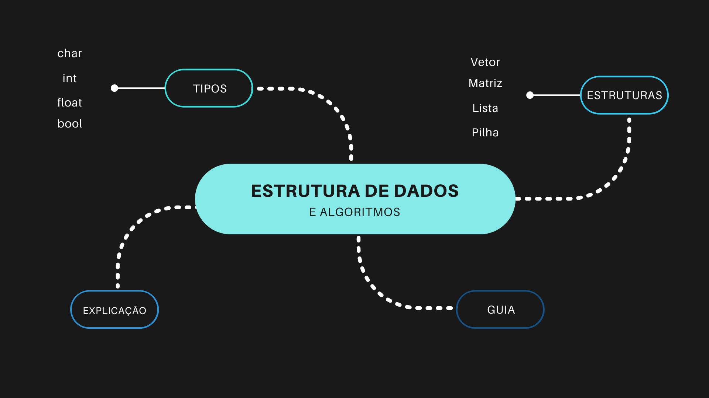

# Estruturas de Dados e Algoritmos 3 (AEDs 3)

Este é o repositório da disciplina **Estruturas de Dados e Algoritmos 3 (AEDs 3)**, ministrada pelo professor [Nome do Professor]. Durante o curso, exploramos tópicos avançados essenciais para a construção de sistemas eficientes, com foco em técnicas de otimização, compressão de dados e segurança. Alguns dos principais temas abordados incluem:

  

- **Tabelas Hash**: Estudo de tabelas hash, incluindo a implementação de funções de dispersão eficientes e técnicas para resolução de colisões, como encadeamento e endereçamento aberto. Analisamos o desempenho das tabelas hash em termos de tempo de busca, inserção e remoção.

- **Listas Invertidas**: Investigação de listas invertidas, que são amplamente usadas em sistemas de busca para indexação e recuperação rápida de dados. Estudamos a implementação e otimização dessas listas para melhorar a eficiência de consultas em grandes volumes de dados.

- **Ordenação Interna**: Análise de algoritmos de ordenação interna, como QuickSort, MergeSort e HeapSort, focando na eficiência e nas vantagens de cada algoritmo dependendo do tipo de dados e do ambiente computacional.

- **Árvores B e B+**: Estudo das árvores B e B+, que são fundamentais em sistemas de gerenciamento de banco de dados e sistemas de arquivos. Discutimos como essas árvores balanceadas proporcionam operações de inserção, remoção e busca de alta performance.

- **Compressão de Dados**: Abordamos técnicas de compressão de dados, como algoritmos de Huffman e LZW, essenciais para otimizar o armazenamento e a transmissão de grandes volumes de informações.

- **Criptografia**: Exploração de algoritmos criptográficos, incluindo criptografia simétrica e assimétrica, e como essas técnicas são aplicadas na segurança de dados, com foco na proteção de informações sensíveis em sistemas computacionais.

Este repositório contém códigos, exercícios e projetos desenvolvidos ao longo do curso, que consolidam os conhecimentos adquiridos e demonstram a aplicação prática dos conceitos teóricos.
